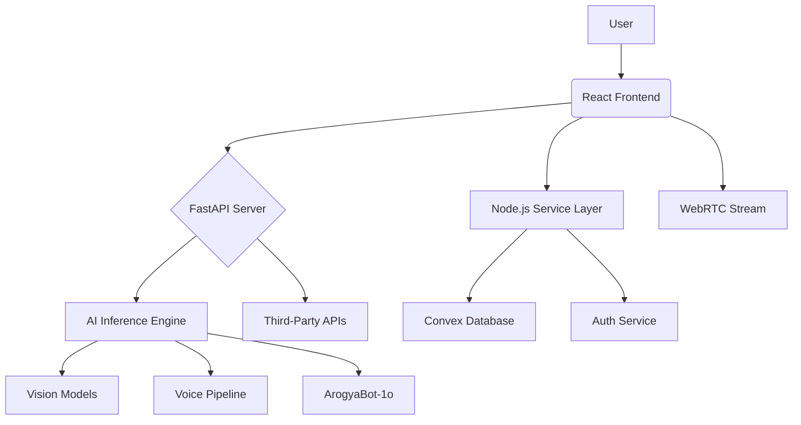

# 🩺 ArogyaMitra: AI-Powered Virtual Nurse Assistant

.jpg)

*"Democratizing healthcare access through AI-powered voice and vision"*

---

## 🌟 Table of Contents
- [✨ Key Features](#-key-features)
- [🛠️ Tech Stack](#-tech-stack)
- [🏗️ System Architecture](#-system-architecture)
- [💻 Installation](#-installation)
- [🐳 Docker Deployment](#-docker-deployment)

---

## ✨ Key Features

### 🤖 Core Capabilities

| Feature                     | Description                                               |
|----------------------------|-----------------------------------------------------------|
| **Multilingual Voice Interface** | Speech-to-text in 5 Indian languages with symptom analysis |
| **Visual Diagnosis**       | Skin/wound assessment via custom CNN models (85%+ accuracy) |
| **Smart Health Tracking**  | Medication reminders + chronic condition monitoring       |
| **Auto-Appointment Booking** | Integrated with 500+ hospitals via Google Calendar API  |
| **Mental Wellness Hub**    | Voice-guided meditation + emotional support chatbot       |

### 🚨 Emergency Features

- Instant first-aid instructions for injuries  
- Critical symptom detection alerts  
- Nearest hospital GPS mapping  

---

## 🛠️ Tech Stack

### Core Components

| Layer        | Technologies                            |
|--------------|-----------------------------------------|
| **Frontend** | React.js, TailwindCSS, ShadCN/ui        |
| **Backend**  | FastAPI (Python), Node.js, Convex DB    |
| **AI/ML**    | PyTorch, Whisper STT, Google TTS        |
| **APIs**     | Twilio SMS, Google Calendar, Deepgram   |
| **DevOps**   | Docker, GitHub Actions, Prometheus      |

### Model Specifications

| Model Type             | Architecture   | Training Data                    |
|------------------------|----------------|----------------------------------|
| Skin Lesion Classifier | ArogyaBot-1o   | ISIC 2020 Dataset (25k images)   |
| Wound Severity Analyzer| ArogyaBot-1o   | Custom dataset (8k trauma images)|
| Speech Recognition     | Whisper Large-v3 | Multilingual medical corpus   |

---
## 🧠 System Architecture




### 1. **User Interaction Layer**
- **Frontend (ArogyaBot UI)**
  - Built with React + Tailwind CSS
  - Supports image uploads and webcam capture
  - Accepts voice and text input
  - Displays multilingual responses in real time

- **Authentication System**
  - Secure login/signup via stack-auth

---

### 2. **Backend Services Layer**
- **Flask Server**
  - Handles API requests and orchestrates the workflow
  - Communicates with AI modules and databases

- **Chatbot**
  - Powered by ArogyaBot-1o Hybrid Multi-Modal finetuned Qwen-2.5-3B Vision Model on Medical Datasets.
  - Manages cross-modality fusion, dialogue generation, and response adaptation

- **Speech Engine**
  - **OpenAI STT** with Whisper-Medium for transcription and noise suppression
  - **Deepgram TTS** with emotion-injected speech generation
  - **Google TTS** with emotion-injected Multilingual speech generation

---

### 3. **Vision & Contextual Intelligence Layer**
- **ArogyBot-1o Injury Detection**
  - Spatial Attention Transformer (SAT)
  - Edge Attention Module (EAM)
  - Multi-scale Feature Fusion
  - Predicts injury severity: Mild / Moderate / Critical

- **Emotion Recognition**
  - Analyzes speech + facial cues
  - Triggers emergency response if distress detected

- **Gesture Recognition**
  - Recognizes emergency gestures (e.g., hand raise)
  - Initiates immediate alert protocol

---

### 4. **Core Utilities & Infrastructure**
- **HuggingFace Spaces**
  - Enables running of ArogyaBot-1o on cloud platform

- **Redis**
  - Caches temporary session data and transcription buffers

- **FFmpeg**
  - Handles audio preprocessing and media conversion

- **Docker**
  - Ensures containerized deployment for backend and frontend

---

### 5. **Emergency Response System**
- **Alert Dispatcher**
  - Auto-initiates hospital calls for critical injuries or distress
  - Logs incident to medical staff dashboard

- **Dashboard Integration**
  - Displays Multiple Helath tools to the user
  - 
---


## 💻 Installation

### Prerequisites

- **Python** **3.11+**
- **Node.js** **18.15+**
- **Redis Server** **7.2+**
- **FFmpeg** **6.0+**

### Local Setup

```bash
# Clone repository
git clone https://github.com/DevankU/ArogyaMitra
cd ArogyaMitra

# Install Python dependencies
python -m venv venv
source venv/bin/activate
pip install -r requirements.txt

# Setup frontend
cd client
npm install
npm run build

# Configure environment variables
cp .env.example .env
```
---

## 🐳 Docker Deployment

```bash
docker-compose -f docker-compose.prod.yml up --build
